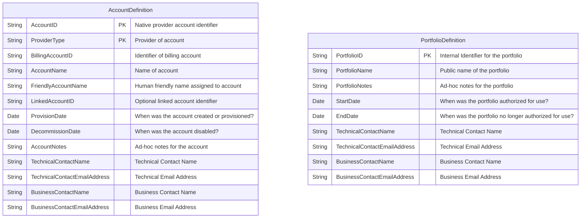

# finops-automation-metadata-rest-server
FinOps Automation - Metadata REST Server

A simple REST solution for tracking provider accounts, portfolios and contact details.

[](https://github.com/finopsautomation/finops-automation-metadata-rest-server/actions/workflows/maven.yml)

## Deployment:

Download the latest release package and execute the JAR file.

## Data attributes



## Core Technology Stack


| Technology | Description | Use |
| -- | -- | -- |
| [finops-automation-metadata-services](https://github.com/finopsautomation/finops-automation-metadata-services) | FinOps Automation Metadata Services | Compile |
| [finops-automation-metadata-repository-aws](https://github.com/finopsautomation/finops-automation-metadata-repository-aws) | Storage of metadata within AWS DynamoDB | Compile |

## Building from Source

finops-automation-metadata-rest-server uses a [Apache Maven](https://maven.apache.org/)-based build system.

In the instructions below, `mvnw` is invoked from the root of the source tree and serves as
a cross-platform, self-contained bootstrap mechanism for the build.

### Prerequisites
[Git](https://help.github.com/set-up-git-redirect) and [JDK 17](https://www.oracle.com/technetwork/java/javase/downloads).

Be sure that your `JAVA_HOME` environment variable points to the `jdk-17` folder extracted from the JDK download.

### Check out sources

```
git clone https://github.com/finopsautomation/finops-automation-metadata-rest-server.git
```

### Compile and run unit tests; build all jars, distribution zips, and docs

Linux
```
./build.sh
```

Windows
```
build
```

